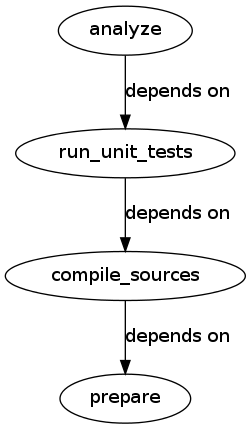

# Continuous building with pybuilder

.fx: titleslide

---

# About us

---

## Maximilien Riehl, Marcel Wolf
  - Working for @YadtProject
  - Sponsored by ImmobilienScout24
  - developing infrastructure as code (TDD, CI, clean code, ...)
  - Agile +  DevOps enthusiasts

---

## Marcel Wolf

  - operations guy become developer
    * started out as System network admin
    * then application manager (ops/dev consulting)
    * now a system developer (python)

---

## Maximilien Riehl

  - system developer with QA background
  - master student in computer science
  - https://github.com/mriehl

---

# Continuous integration

---

# Python toolchain and CI

---

# Claim
 * Many awesome tools but they do not compose

---

# Working example

 * pure python project
 * unit tests (*py.test*)
 * integration tests (*unittest*)
 * coverage metrics (*coverage*)
 * quality metrics (*flake8*)
 * packaged (*setuptools*)

---

## Requirements for CI (1/2)

  - Break build when...

    * coverage
< 100%
    * unit / integration tests fail
    * linter finds problems

---

## Requirements for CI (2/2)

  - Package only when all previous steps complete
  - Orchestrate

    * install dependencies before running stuff
    * run unit tests before integration tests
    * etc...

---

## Approaches
### DIY
    * fit everything together (by our own)

### Pybuilder
    * fits everythin together (for you)
---

# DIY

.fx: titleslide

---

#### Measure coverage (homemade)

    !bash
    #!/bin/bash
        coverage run py.test src
        COVERAGE=$(coverage report | tail -n 1 | ...
        echo "Coverage is $COVERAGE%"
        if [ $COVERAGE -lt 100 ]; then
          echo "Coverage sucks, breaking the build!" >
    &1
          exit 1
        fi

---

#### Measure coverage (setuptools style)

    !python
    class run_coverage(Command):
        description = "Generate a test coverage report."
        user_options = []
        def initialize_options(self): pass
        def finalize_options(self): pass
        def run(self):
            import subprocess
            subprocess.call(['coverage', 'run'])
            subprocess.call(['coverage', 'html'])

Or use API?

---

#### Orchestration

    !bash
    set -e -E
    pip install -r REQUIREMENTS.txt
    ./setup.py test
    ./setup.py integrationtest
    ./setup.py lint
    ./setup.py coverage
    ./setup.py build
    ./setup.py sdist
    ./setup.py sdist upload

---

#### Issues
  * Non-generic
  * Reusability
    - "I have solved this problem before...?"
  * Complexity
  * Run sub-parts (only coverage / lint)?

---

# Pybuilder

.fx: titleslide

---

#### Basics

 * Plugin-based
 * Central build description
 * It's python! (`build.py`)

---

#### Project data

    !python
    name = 'pycopter'
    url = 'https://github.com/ninja/pycopter'
    license = 'MIT'
    authors = [Author('pyninja', 'ninja@example.org')]
    summary = 'Example project'
    version = '1.3.37'

---

#### Adding plugins

    !python
    use_plugin('python.coverage')
    use_plugin('python.distutils')
    use_plugin('python.unittest')
    use_plugin('python.flake8')

---

#### Configuration

    !python
    @init
    def set_properties(project):
        project.set_property("coverage_break_build", True)
        project.set_property("coverage_threshold_warn",99)
        project.set_property("flake8_break_build", True)

---

#### Dependencies

    !python
    project.build_depends_on("pytest")
    project.depends_on("ultrajson")

---

#### Orchestration

  * Task-oriented

  * Examples
    <table border="1">
        <tr>
            <th>Task</th>
            <th>Depends</th>
        </tr>
        <tr>
            <td>analyze</td>
            <td>run_unit_tests</td>
        </tr>
        <tr>
            <td>verify</td>
            <td>run_integration_tests</td>
        </tr>
        <tr>
            <td>run_unit_tests</td>
            <td>compile_sources</td>
        </tr>
        <tr>
            <td>install_dependencies</td>
            <td>None</td>
        </tr>
    </table>

---

pyb publish
    

---

Vielen Dank für eure Aufmerksamkeit

https://github.com/pybuilder/pybuilder

- email: maximilien.riehl@immobilienscout24.de
- email: marcel.wolf@immobilienscout24.de
