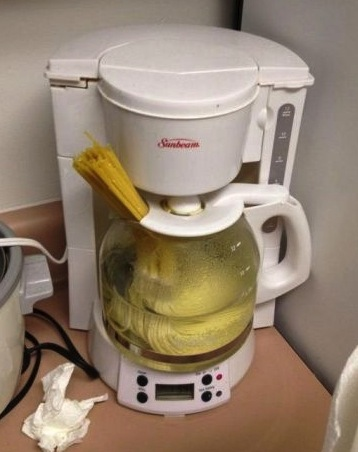
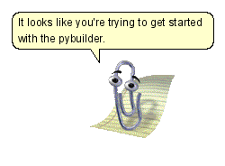

# Continuous building with pybuilder

.fx: titleslide

---

# About us

---

## About us

  - Working on @YadtProject
  - Sponsored by ImmobilienScout24
  - developing infrastructure as code (TDD, CI, clean code, ...)
  - Agile +  DevOps enthusiasts

---

## Marcel Wolf

  - operations guy gone dev
    * started out as system/network admin
    * then application manager (ops/dev consulting)
    * now a system developer

---

## Maximilien Riehl

  - system developer with QA background
  - master student in computer science
  - https://github.com/mriehl

---

# Continuous integration

---

# Python toolchain and CI

---

# Claim
 * Many awesome tools but they do not compose

---

# Working example

 * pure python project
 * unit tests (*py.test*)
 * integration tests (*unittest*)
 * coverage metrics (*coverage*)
 * quality metrics (*flake8*)
 * packaged (*setuptools*)

---

## Requirements for CI (1/2)

  - Break build when...

    * coverage
< 100%
    * unit / integration tests fail
    * linter finds problems

---

## Requirements for CI (2/2)

  - Orchestrate
    * Package only when all previous steps complete
    * install dependencies before running stuff
    * run unit tests before integration tests
    * etc...

---

## Approaches
### DIY
  * fit everything together
    - on your own
    - for your specific use-case

### Pybuilder
  * fits everything together for you
    - more time to write real code!
---

# DIY

.fx: titleslide

---

#### Measure coverage (homemade)

    !bash
    #!/bin/bash
        coverage run py.test src
        COVERAGE=$(coverage report | tail -n 1 | ...
        echo "Coverage is $COVERAGE%"
        if [ $COVERAGE -lt 100 ]; then
          echo "Coverage sucks, breaking the build!" >
    &1
          exit 1
        fi

---

#### Measure coverage (setuptools style)

    !python
    class run_coverage(Command):
        description = "Generate a test coverage report."
        user_options = []
        def initialize_options(self): pass
        def finalize_options(self): pass
        def run(self):
            import subprocess
            subprocess.call(['coverage', 'run'])
            ...
            subprocess.call(['coverage', 'report'])

Or use API?

---

#### Orchestration

    !bash
    #!/bin/bash
    set -e
    pip install -r REQUIREMENTS.txt
    ./setup.py test
    ./setup.py integrationtest
    ./setup.py lint
    ./setup.py coverage
    ./setup.py build
    ./setup.py sdist
    ./setup.py sdist upload

---

#### Issues
  * Complexity
  * Non-genericity

---

#### Non-genericity
  * How about changing a test framework?
  * What would happen if setuptools was dropped?

---

#### Issues
  * Complexity
  * Non-genericity
  * Non-reusability
  * Run sub-parts?

---

# Pybuilder

.fx: titleslide

---

#### Basics

 * It's python!
 * command line interface
 * Plugin-based
 * Project structure
 * Central build description (`build.py`)

---

#### Project data (build.py)

    !python
    name = 'pycopter'
    url = 'https://github.com/ninja/pycopter'
    license = 'MIT'
    authors = [Author('pyninja', 'ninja@example.org')]
    summary = 'Example project'
    version = '1.3.37'
    ...

---

#### Adding plugins (build.py)

    !python
    use_plugin('python.coverage')
    use_plugin('python.distutils')
    use_plugin('python.unittest')
    use_plugin('python.flake8')
    ...
---

#### Configuration

    !python
    @init
    def set_properties(project):
        project.set_property("coverage_break_build", True)
        project.set_property("coverage_threshold_warn",99)

        # is the default value
        project.set_property("dir_source_main_python",
                             "src/main/python")
    ...
---

###  Without build.py

    !bash
    #!/bin/bash
        coverage run py.test src
        COVERAGE=$(coverage report | tail -n 1 | ...
        echo "Coverage is $COVERAGE%"
        if [ $COVERAGE -lt 100 ]; then
          echo "Coverage sucks, breaking the build!" >
    &1
          exit 1
        fi

---

#### Dependencies (build.py)

    !python
    project.build_depends_on("pytest")
    project.depends_on("ultrajson")
    ...

---

#### Orchestration

  * Task-oriented

  * Examples
    <table border="1">
        <tr>
            <th>Task</th>
            <th>Depends</th>
        </tr>
        <tr>
            <td>analyze</td>
            <td>run_unit_tests</td>
        </tr>
        <tr>
            <td>verify</td>
            <td>run_integration_tests</td>
        </tr>
        <tr>
            <td>run_unit_tests</td>
            <td>compile_sources</td>
        </tr>
        <tr>
            <td>install_dependencies</td>
            <td>None</td>
        </tr>
    </table>

---

pyb analyze

  * runs analyze tasks, but also...

---

# Getting started

  * Visit http://pybuilder.github.io
  * Source, PRs and issues at https://github.com/pybuilder

---

Thank you for your attention!
Questions?

https://github.com/pybuilder/pybuilder

- max@riehl.io
- marcel.wolf@immobilienscout24.de
